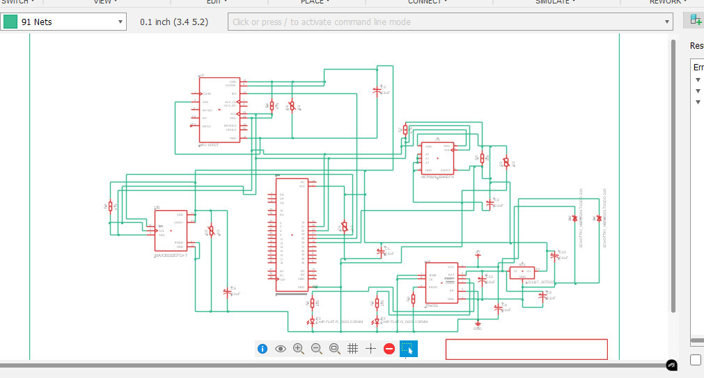
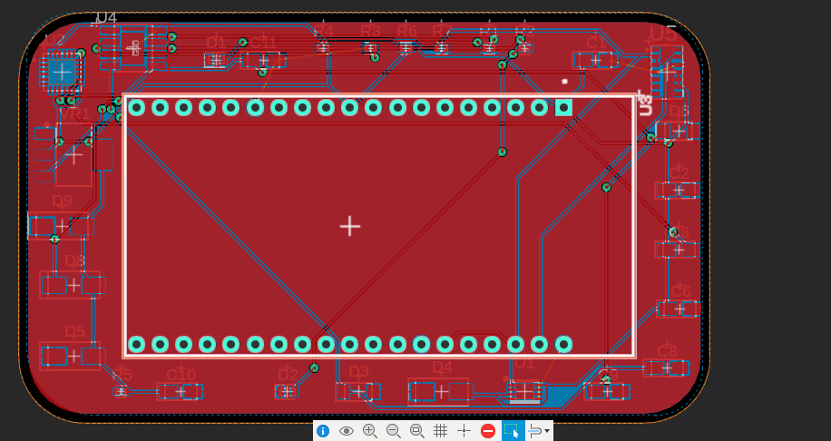
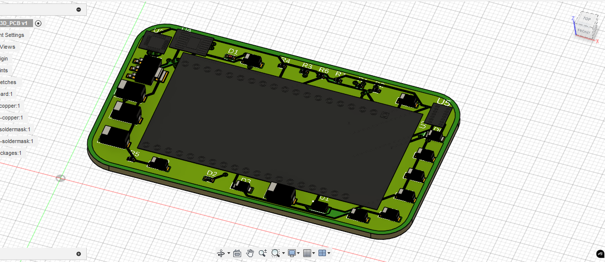
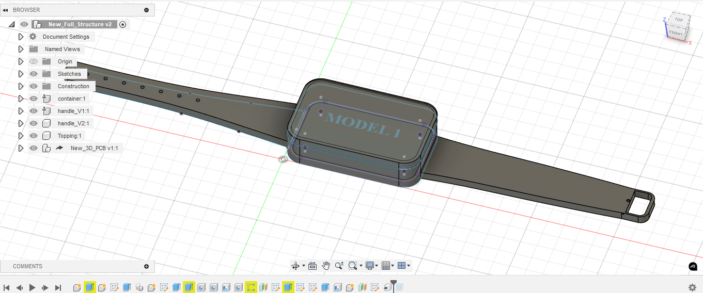
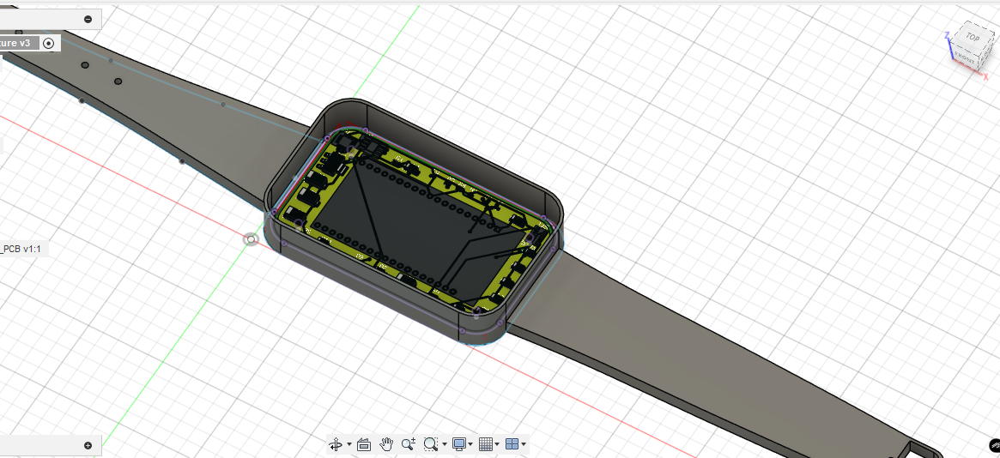

# smart_watch_x1
The first attempt into making a full smart watch system using fusion 360.

I have successfully made the schematics, PCB, and the 3D PCB. I have also prepared the structure design and imported the 3D PCB into it.

The photos shows the design.

The main components used are:
1- MCU: ESP32.
2- MAX30102. (Heart beat rate sensor)
3- MPU6050. (Accelerometer & Gyroscope)
4- MCP9808. (Temperature Sensor)
5- TP4056. (Charging System)
6- Li-Battery.
7- The other components such as capacitors, leds, etc.

--------------------------------------------------------------
Next, I start with the coding process.

The main.cpp file contains the code that will be used for the ESP32 to obtain the values from the sensors.

Since, we are not using a real version, we can't get real values so we have to create our own dataset.

I obtained a dataset of 10000 samples from chatgpt.

First, in the data_generate file, I grouped every 10 samples together into a group then shuffled the groups.
The second step will be to make another dataset from the existing one but instead of showing the data of the sensors, I want the slope, the change and the average of the data of each 10 samples.
Depending on the change should be the factor for the machine learning model later to decide which state is the user at.

The analysis.py file is responsible for getting the average values for each group of states and store them into a new dataset to be used to train our machine learning model.

ml_test.py is where we create our machine learning test model which will be responsible for handling the data and make the final dicision.

I have finished training the model with each DecisionTree and RandomForest models. Both models gave excellent accuracy of above 99% near to 100%, which can be expected since this data was made using code.

I have finished the class responsible for the machine learning model and it's inside ml_model.py file. The class has 2 attributes, either giving a data_path to train a new model or provide the model_file of a previously trained model.
In case of trainning a new model, it automatocally splits and prepare the data. Then, the user has to call the method for which model he wants to train. After the training, a new file for the trained model can be found which can then be assigned to the model_file attribute which will automatically load the model and then, the model can be again used.

I have created a file burn_cal.py which has a class responsible for handling the calculations of the calories burnt by the user for every entery the user enters for a duration of a 1 minute.

The main_py.py has the main code for calling the previously made model to be used.

